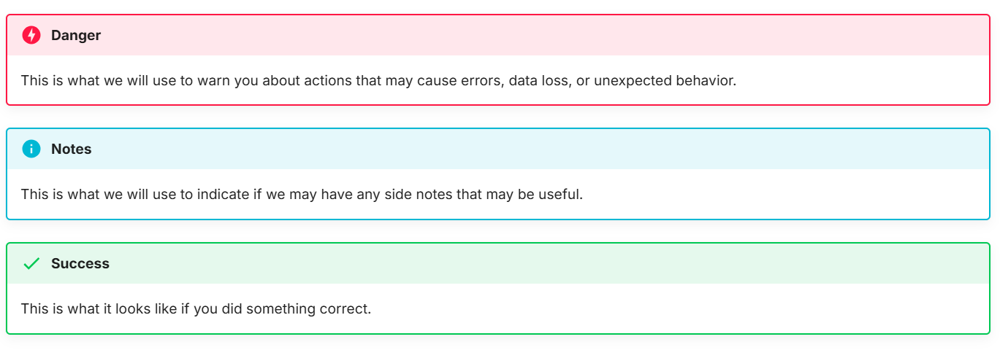

# Overview of Git and GitHub User Documentation


This documentation provides step-by-step instructions for using [Git](https://git-scm.com/) and [GitHub](https://github.com/) in a Windows 11 environment.

The goal of this documentation is to help new CST students get comfortable with the most common Git operations they will use throughout their courses and future projects. 

These are the topics of this document:

- Cloning a repository from GitHub
- Committing and pushing changes
- Branching and merging
- Resolving merge conflicts


## How We Planned and Collaborated


We chose Git and GitHub as our main topic for this user documentation primarily due to one of our peers struggling to use it during a hackathon. 

Our main communication tool was Discord and we leveraged in-person meetings to work on this project together. We also used Git and GitHub to collaborate our work and utilized branches to prevent us from overwriting each other's work.


## How We Created This Guide


Our guide was created based on our experience using Git and GitHub across multiple CST courses and hackathons. We referenced the official [Git documentation](https://git-scm.com/doc) and [GitHub Docs](https://docs.github.com) to help us recall and learn some of the commands.

### Using MkDocs

We used [Material for MkDocs](https://squidfunk.github.io/mkdocs-material/) as our static site generator because it provides admonitions, code blocks with syntax highlighting, table of contents, emojis, and a lot more. We customized the theme with GitHub themed colours such as `indigo` for the primary and `slate` for the background.

### Using Markdown

All documentation pages were written in Markdown with MkDocs Material extension to customize the style, fonts, and colours. We had prior experience using markdown but writing this document made us more comfortable using it.

### Using VS Code

Both of us used VS Code to write all Markdown files. We used `mkdocs serve` to preview our work before pushing our changes to GitHub.

## How We Improved Readability


Git and GitHub are most commonly used via a terminal so we used code blocks to make it easier for users to distinguish code from text as well as make it easier to copy code.

```
code block example
```

We also added images and GIFs to help provide a more clearer step-by-step instruction.

<div align="center">
  
</div>

<!--  -->

Additionally, we used MkDocs Material admonitions to highlight important information:




## Conclusion

Writing this documentation helped us gain more knowledge on how to use Git and GitHub on a deeper level. 

We hope this guide serves as a useful reference for new CST students, COMP 1800 students, and anyone that's just getting started with Git and GitHub.

This document was built on: [Material for MkDocs](https://squidfunk.github.io/mkdocs-material/).
