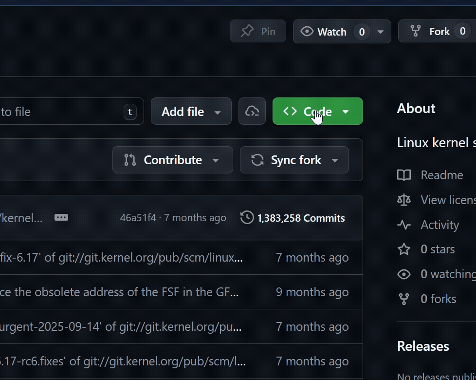

# Task 1: Cloning a Repository

## Overview

Cloning is the first step to working with any existing project on GitHub. When you **clone** a repository, you create a local copy of the entire project on your computer, including all of its files, folders, and version history. This allows you to work on the project offline and push your changes back to GitHub when you're ready.

By the end of this task, you will be able to:

- Find and copy a repository URL from GitHub
- Clone a repository to your local machine using the terminal
- Open the cloned project in Visual Studio Code
- Verify the clone was successful

---

## Finding the Repository URL

Before cloning, you need to get the URL of the repository from GitHub.

1. **Open** your web browser and navigate to [github.com](https://github.com).
2. **Navigate** to the repository you want to clone (e.g., your instructor's project repo or your own).
3. **Click** the green **<> Code** button near the top-right of the repository page.
4. **Ensure** that **HTTPS** is selected (it should be by default).
5. **Click** the copy icon next to the URL to copy it to your clipboard.

{: alt="GitHub repository page showing the green Code button expanded with the HTTPS URL and copy icon highlighted" style="display: block; margin: 0 auto; width:700px" }

*Figure 1: The GitHub Code button with the HTTPS URL ready to copy.*

!!! info "HTTPS vs SSH vs GitHub CLI"
    You will notice there are three options: **HTTPS**, **SSH**, and **GitHub CLI**. For this guide, we will use HTTPS because it is the simplest to set up. SSH requires generating and configuring SSH keys, while GitHub CLI requires installing GitHub's command-line tool, both are a more advanced topic.

---

## Opening the Terminal in VS Code

Now that you have the repository URL copied, open VS Code and navigate to the folder where you want to store the project.

1. **Open** Visual Studio Code.
2. **Open** the integrated terminal by pressing `` Ctrl + ` `` or navigating to **Terminal > New Terminal** in the menu bar.
3. **Navigate** to the folder where you want to store the cloned project using the `cd` command.

For example, to navigate to your Desktop:


> cd Desktop


{: alt="Visual Studio Code window with the integrated terminal panel open at the bottom"}

*Figure 2: The VS Code integrated terminal.*

!!! info "Choosing a Location"
    Pick a location you will remember. Many developers create a dedicated folder like `C:\Users\YourName\Projects` or `C:\dev` to keep all their repositories organized.

---

## Cloning the Repository

With your terminal open and in the right directory, you can now clone the repository.

1. **Type** the following command, replacing the URL with the one you copied from GitHub:

    
> git clone https://github.com/username/repository-name.git


2. **Press** **Enter** and wait for the cloning process to complete.

You should see output similar to this:

```
Cloning into 'repository-name'...
remote: Enumerating objects: 42, done.
remote: Counting objects: 100% (42/42), done.
remote: Compressing objects: 100% (30/30), done.
Receiving objects: 100% (42/42), 15.20 KiB | 3.80 MiB/s, done.
```

{: alt="Terminal window displaying the output of a successful git clone command with progress information"}

*Figure 3: Terminal output after a successful clone.*

!!! success "Success"
    If you see a message like the one above without any errors, your repository has been cloned successfully!

!!! danger "Common Error: Repository Not Found"
    If you see `fatal: repository not found`, double-check that:

    - The URL you copied is correct
    - The repository is **public**, or you have access to it if it is private
    - You do not have any typos in the URL

---

## Opening the Cloned Project

Now that the repository is on your machine, open it in VS Code.

1. **Navigate** into the newly created folder in the terminal:


> cd repository-name
  

2. **Run** the following command to open the project in VS Code:


> code .


This will open a new VS Code window with all the project files visible in the **Explorer** panel on the left.

{: alt="Visual Studio Code window showing the cloned project files and folders in the Explorer sidebar"}

*Figure 4: The cloned project open in VS Code.*

!!! info "Alternative Method"
    You can also open the folder manually by going to **File > Open Folder** in VS Code and selecting the cloned repository folder.

---

## Verifying the Clone

To confirm everything is set up correctly, run the following commands in the terminal.

1. **Run** `git status` to check the state of the repository:


> git status


    You should see output like:

    ```
    On branch main
    Your branch is up to date with 'origin/main'.

    nothing to commit, working tree clean
    ```

2. **Run** `git remote -v` to verify the remote connection:


> git remote -v


    This should display the GitHub URL you cloned from:

    ```
    origin  https://github.com/username/repository-name.git (fetch)
    origin  https://github.com/username/repository-name.git (push)
    ```

{: alt="Terminal window showing the output of git status and git remote -v commands confirming a successful clone"}

*Figure 5: Verifying the clone with `git status` and `git remote -v`.*

!!! success "Success"
    If both commands return the expected output, you have successfully cloned the repository and are ready to start working!

---

## Conclusion

In this task, you learned how to:

- Locate and copy a repository URL from GitHub
- Clone a repository to your local machine using `git clone`
- Open the cloned project in Visual Studio Code
- Verify the clone with `git status` and `git remote -v`

You now have a local copy of the repository on your computer. In the next task, you will learn how to make changes, commit them, and push them back to GitHub.
