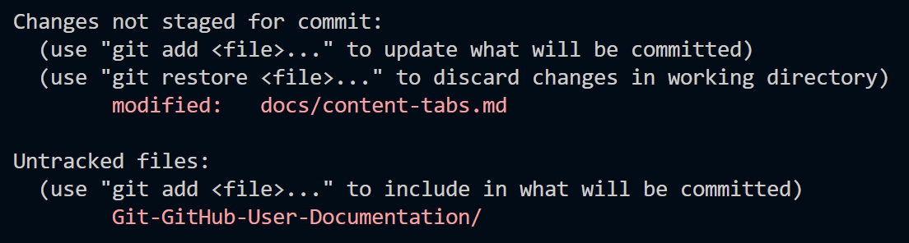
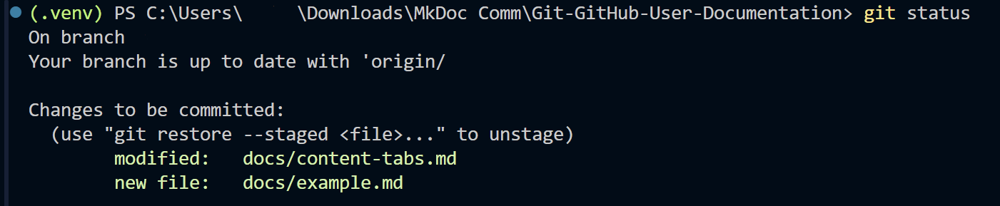

# Task 2: Committing and Pushing Changes

## Overview

Now that you have a local copy of a repository, you need to know how to save your work and upload it to GitHub. In Git, this is a two-step process: **committing** saves a snapshot of your changes locally, and **pushing** uploads those commits to the remote repository on GitHub.

By the end of this task, you will be able to:

- Check the status of your working directory
- Stage files for a commit
- Write a meaningful commit message
- Push your commits to GitHub

---

## Checking the Status of Your Changes

Before committing, it is good practice to see what has changed in your project.

1. **Open** the terminal in VS Code (`` Ctrl + ` ``).
2. **Run** the following command:

>git status


You should see output showing your modified, added, or deleted files:

```
On branch main
Changes not staged for commit:
  (use "git add <file>..." to update what will be committed)

        modified:   index.html

Untracked files:
  (use "git add <file>..." to include in what will be committed)

        about.html
```

{: alt="Terminal window displaying git status output with one modified file and one untracked file listed"}

*Figure 1: The output of `git status` showing changed files.*

!!! info "Understanding the Output"
    **Modified** files are existing files you have changed. **Untracked** files are new files that Git has not seen before. **Deleted** files are files you have removed from the project. None of these changes are saved to Git yet. They are only on your local file system.

---

## Staging Your Changes

Before Git can commit your changes, you need to **stage** them. Staging tells Git which changes you want to include in your next commit.

### Staging Specific Files

1. **Run** the following command to stage a specific file:


> git add index.html

2. **Run** the following to stage multiple specific files:

    
> git add index.html about.html
    

### Staging All Changes

1. **Run** the following command to stage all modified and untracked files at once:

    
> git add .


!!! danger "Be Careful with `git add .`"
    Using `git add .` stages **everything** in the current directory, including files you might not want to commit (like temporary files, logs, or configuration files with sensitive data). Always run `git status` before and after staging to make sure you are only committing what you intend to.

After staging, verify your staged files:

1. **Run** `git status` again:


> git status


You should now see your files listed under **"Changes to be committed"**:

```
On branch main
Changes to be committed:
  (use "git restore --staged <file>..." to unstage)

        modified:   index.html
        new file:   about.html
```

{: alt="Terminal window displaying git status output with files listed under Changes to be committed"}

*Figure 2: Staged files ready to be committed.*

!!! success "Success"
    If your files appear under "Changes to be committed," they are staged and ready to be committed.

---

## Committing Your Changes

Now that your changes are staged, you can create a **commit**. A commit is a snapshot of your project at a specific point in time, along with a message describing what changed.

1. **Run** the following command:

> git commit -m "Add about page and update index"


You should see output like:

```
[main a1b2c3d] Add about page and update index
 2 files changed, 25 insertions(+), 3 deletions(-)
 create mode 100644 about.html
```

{: alt="Terminal window displaying the output of a successful git commit command with file change summary"}

*Figure 3: A successful commit with a descriptive message.*

!!! info "Writing Good Commit Messages"
    A good commit message is short, descriptive, and written in the **imperative mood** (like giving a command). Think of it as completing the sentence: *"If applied, this commit will..."*

    **Good examples:**

    - `Add navigation bar to homepage`
    - `Fix broken link on contact page`
    - `Update README with setup instructions`

    **Bad examples:**

    - `stuff` - too vague
    - `fixed things` - does not say what was fixed
    - `asdfgh` - not descriptive at all

!!! danger "Don't Forget the `-m` Flag"
    If you run `git commit` without the `-m` flag, Git will open a text editor (usually Vim) for you to write your message. If this happens and you are not familiar with Vim, press `Esc`, type `:q!`, and press **Enter** to exit without saving. Then try again with the `-m` flag.

---

## Pushing Your Commits to GitHub

Your commit is currently saved **locally** on your machine. To upload it to GitHub so others can see it, you need to **push**.

1. **Run** the following command:


> git push
  

If this is your first time pushing, Git may ask you to set the upstream branch:

  
> git push -u origin main
    

You should see output similar to:

```
Enumerating objects: 5, done.
Counting objects: 100% (5/5), done.
Delta compression using up to 8 threads
Compressing objects: 100% (3/3), done.
Writing objects: 100% (3/3), 1.02 KiB | 1.02 MiB/s, done.
Total 3 (delta 1), reused 0 (delta 0)
To https://github.com/username/repository-name.git
   c3d4e5f..a1b2c3d  main -> main
```

{: alt="Terminal window displaying the output of a successful git push command uploading commits to GitHub"}

*Figure 4: A successful push to GitHub.*

!!! success "Success"
    If you see output like the above with no errors, your changes have been pushed to GitHub! You can verify by visiting your repository on GitHub and checking that your changes appear.

!!! danger "Authentication Error"
    If you see an authentication error when pushing, you may need to set up a **Personal Access Token (PAT)** instead of using your GitHub password. GitHub no longer supports password authentication for Git operations.

    To create a PAT:

    1. **Go** to **GitHub > Settings > Developer settings > Personal access tokens > Tokens (classic)**
    2. **Click** **Generate new token**
    3. **Give** it a name, select the **repo** scope, and generate it
    4. **Use** this token as your password when prompted by Git

---

## Verifying on GitHub

As a final check, confirm your changes appear on GitHub.

1. **Open** your web browser and navigate to your repository page on [github.com](https://github.com).
2. **Check** that your latest commit message appears at the top of the file list.
3. **Click** on the modified files to confirm your changes are there.

{: alt="GitHub repository page with the latest commit message visible at the top of the file list"}

*Figure 5: The latest commit visible on GitHub.*

!!! success "Success"
    If you can see your commit message and changes on GitHub, you have successfully committed and pushed your work!

---

## Conclusion

In this task, you learned how to:

- Check the status of your changes with `git status`
- Stage files using `git add`
- Create a commit with a descriptive message using `git commit -m`
- Push your commits to GitHub using `git push`
- Verify your changes on GitHub

This is the workflow you will be using every time you work on a project. In the next task, you will learn how to create branches and merge them, which lets you work on features without affecting the main codebase.